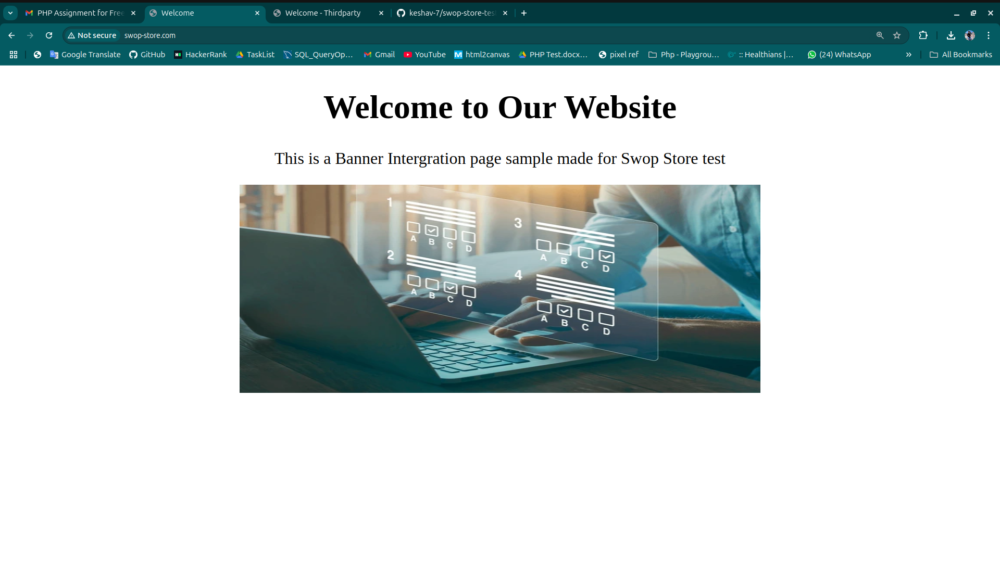
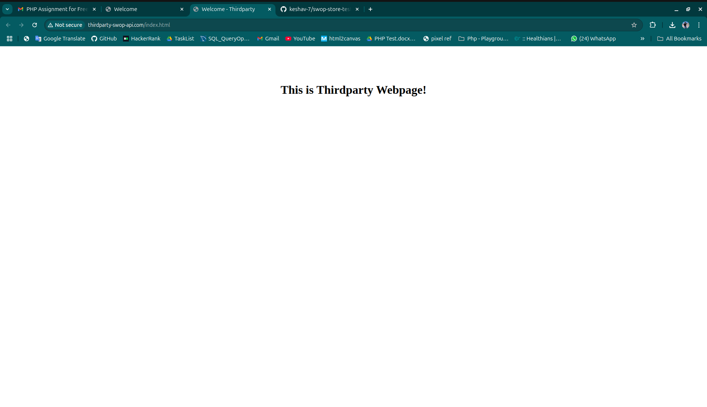

# swop-store-test
This is a Banner Intergration page sample made for Swop Store test.

# Banner Integration Assignment Documentation

## 1. Introduction

This documentation outlines the complete process of integrating a dynamic banner into a third-party website using two virtual hosts. The assignment demonstrates how to create a flexible and reusable solution that fetches banner details from an API endpoint and displays it across domains. The goal is to provide third-party sites with a simple script that, when embedded, automatically renders a customized banner served from a different domain.

## 2. Project Overview and Objectives

- **Objective:**  
  Develop a mechanism that allows any website (the host) to display a banner dynamically. The banner details (including image URL, clickable link, and alt text) are provided by an API through a dedicated domain.

- **Key Functionalities:**  
  - A PHP backend provides the banner's details in a JSON format via a publicly accessible API.
  - A JavaScript file is built to fetch these details and to dynamically insert the banner into the webpage.
  - Optional parameters such as width, height, and position can be passed via the URL when embedding the script.

## 3. System Architecture

The integration pattern leverages two virtual hosts:

- **Virtual Host 1 – swop-store.com:**  
  This domain represents the third-party website where the banner will be displayed. It includes the banner integration script within its HTML pages.

- **Virtual Host 2 – thirdparty-swop-api.com:**  
  This domain hosts both the public API endpoint, which provides the banner details, and the JavaScript file that handles the integration. Separating the API from the consuming website emphasizes the modular and cross-domain design of the system.

## 4. Detailed Implementation Steps

### A. Setting Up the API Endpoint

1. **PHP API Development:**  
   The backend is built using PHP and is responsible for serving banner details in JSON format. The endpoint is designed to return information such as the banner's image URL, landing page link, and alternate text. This endpoint is hosted on the API domain.

2. **Cross-Origin Resource Sharing (CORS):**  
   Since the API is consumed by a website hosted on a different domain, appropriate HTTP headers are set to allow cross-domain requests. This is crucial for ensuring that browsers permit the third-party website to fetch data from this API endpoint.

3. **Dynamic Data Provisioning:**  
   Although the assignment uses static banner details, the approach is designed to be dynamic. In a production environment, banner information could easily be retrieved from a database or updated through an administrative interface without altering the integration script.

### B. Creating the Banner Integration Script

1. **Embedding via JavaScript:**  
   The integration script is written in JavaScript and served from the API host. This script is self-contained and meant to be embedded in any HTML page via a simple script tag. Its role is to seamlessly render the banner on the client site.

2. **Parameter Extraction:**  
   To offer flexibility, the script is designed to read query parameters from its own URL. Parameters such as width, height, and banner position (e.g., top or bottom of the page) can be defined when including the script. This means that even though the base logic remains the same, the appearance and placement of the banner can be easily customized on a per-site basis.

3. **Fetching Banner Details:**  
   Once the script is executed, it sends a request to the PHP API endpoint hosted on the API domain. Using modern techniques (such as Fetch API semantics), it retrieves the JSON structure containing the banner data. The inclusion of CORS headers makes this cross-domain request possible.

4. **Dynamic Element Creation and Styling:**  
   The JavaScript dynamically builds the banner elements. It creates an outer container element and applies styling based on either the default settings or the values provided via query parameters. A clickable link element is generated, encapsulating an image element. The image element uses the URL, alt text, and other details provided by the API. The container is then inserted into the webpage’s document, making the banner visible to the site's visitors.

5. **Error Handling:**  
   Robust error handling is incorporated so that any issues with fetching data from the API (such as network errors or invalid responses) do not adversely affect the third-party website. Should an error occur, it is logged to the browser console without disrupting the overall user experience.

### C. Integrating the Banner into the Third-Party Website

1. **Script Tag Inclusion:**  
   On the third-party website (swop-store.com), the integration is as simple as adding a script tag in the HTML markup that points to the JavaScript file on the API host. Query parameters appended to the script’s URL allow the site owner to customize the banner’s dimensions and position.

2. **Displaying the Banner:**  
   When the page loads, the browser fetches the JavaScript file, which in turn contacts the API to obtain the banner details. The banner is dynamically constructed and inserted into the webpage. The process is transparent to the end user and requires no additional configuration from their side.

## 5. Testing and Verification

### A. Local Testing
- Verify that the PHP API endpoint is reachable from a browser. It should return a well-formed JSON response.
- Test the integration script by embedding it in a local HTML page that simulates a third-party site. Observe that the banner appears with the correct styling and data.

### B. Cross-Domain Requests
- Ensure that the CORS headers in the PHP response correctly permit requests from the third-party website. Use browser developer tools to inspect the network requests and console logs to catch any errors.
- Check that the dynamic query parameters modify the appearance as intended (for example, by altering the banner’s width, height, or position).

### C. Edge Cases and Fallbacks
- Consider what happens if the API fails to return data, including how the script handles such errors.
- Optionally design a fallback mechanism (like displaying a default banner or hiding the container) to maintain a clean user interface even in error scenarios.

## 6. Additional Considerations and Future Enhancements

1. **Dynamic Content Management:**  
   Integrating a database or a content management system in the future could allow real-time updates to the banner details, enhancing the flexibility of the system without requiring code changes.

2. **Responsive Design:**  
   Implementing responsive design techniques would ensure the banner adapts to various screen sizes and devices. This might include using media queries or dynamically adjusting properties via JavaScript.

3. **Security and Performance:**  
   Further security measures like rate limiting on the API endpoint, input validation, and robust error handling will protect against misuse. Performance optimizations such as caching strategies and asynchronous loading can be explored to ensure the banner loads efficiently.

4. **Enhanced Customization Parameters:**  
   Expanding the query parameters to control additional visual elements (for example, borders, margins, or even animation effects) could provide third-party websites with greater control over the appearance and behavior of the banner.

**Screenshots:**
--

   

--

